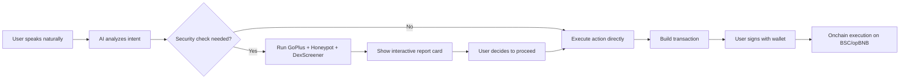

English | [中文](PROJECT.zh-CN.md)

# BNBrain — Project Overview

> **Track: Agent (AI Agent x Onchain Actions)**
> An AI-powered security agent that doesn't just analyze — it acts, transacts, and protects onchain.

---

## 1. Problem

### The Security Gap in BNB Chain

BNB Chain processes **millions of daily transactions**, making it one of the most active blockchains. But this activity comes with a dark side:

- **Rug pulls and honeypot tokens** launch daily, trapping users who lack the tools to verify before buying
- **Phishing sites** mimic popular DeFi protocols, stealing wallet approvals and draining funds
- **Unlimited token approvals** sit forgotten in wallets, creating ticking time bombs for exploit attacks
- **Contract vulnerabilities** go undetected because security auditing requires deep Solidity expertise

**The core problem:** Existing security tools are **fragmented and passive**. Users must manually switch between GoPlus, DexScreener, BscScan, PancakeSwap, and MetaMask to complete a single safe transaction. Each tool provides raw data but no actionable guidance. Non-technical users — who are most vulnerable — are effectively locked out of security best practices.

**Who is affected:**
- **Retail DeFi users** who buy tokens without knowing how to check for honeypots
- **NFT collectors** who can't verify collection-level risks before minting
- **Active traders** who accumulate risky approvals over time
- **New users** who find the multi-tool workflow overwhelming and make costly mistakes

---

## 2. Solution

### One AI Agent That Does Everything

BNBrain is an **AI agent that takes real actions on BNB Chain through natural conversation**. Instead of switching between 5+ tools, users simply describe what they want — and the AI handles security scanning, trading, contract deployment, and wallet management in one unified interface.

**Key capabilities:**

- **37 AI tools** covering security analysis, DeFi trading, wallet management, smart contract operations, market data, and onchain proof
- **Cross-source security verification** — GoPlus + Honeypot.is + DexScreener + BscScan data combined for comprehensive risk assessment
- **One-click swap** via PancakeSwap V2 with built-in safety checks before every trade
- **Smart contract compilation & deployment** — write Solidity in chat, compile with OpenZeppelin support, deploy with one click, auto-verify on BscScan
- **Onchain report storage** — security scan results hashed and stored on-chain as tamper-proof evidence
- **24 interactive result cards** — rich visual UI for every tool output, not just text
- **Worker-based architecture** — AI keeps running even if the user closes their browser tab

**What makes BNBrain different from existing tools:**

| Existing Approach | BNBrain |
|---|---|
| Manual: open GoPlus, paste address, read JSON | "Is this token safe?" → instant visual report |
| Open PancakeSwap, check price, set slippage, swap | "Swap 0.1 BNB for USDT" → one-click confirmation |
| Read Solidity, find compiler, deploy via Remix | "Deploy a token called X" → compiled & deployed |
| Check each approval one by one on approval checkers | "Scan my wallet" → full health report + revoke buttons |

---

## 3. Business & Ecosystem Impact

### Target Users

1. **Primary: Retail DeFi users on BNB Chain** — Anyone who trades tokens, provides liquidity, or interacts with dApps and wants to do it safely
2. **Secondary: Developers building on BNB Chain** — Contract deployment, verification, and testing through conversation
3. **Tertiary: Security researchers** — Deep analysis reports with onchain proof storage

### Value to the BNB Chain Ecosystem

- **Reduces scam losses** — Pre-trade security scanning catches honeypots, rug pulls, and phishing before users lose funds
- **Lowers entry barrier** — Non-technical users can safely participate in DeFi through natural language
- **Increases transaction quality** — Every swap, deploy, and approval is wrapped with safety checks
- **Onchain trust layer** — Security report hashes stored on-chain create a verifiable, immutable audit trail
- **Open source** — MIT licensed, any project can integrate or extend the agent's capabilities

### Adoption Path

- **Phase 1 (Current):** Free web app at [app.bnbrain.dev](https://app.bnbrain.dev) — self-hostable via Docker/Railway
- **Phase 2:** API for other dApps to embed BNBrain's security scanning
- **Phase 3:** Telegram/Discord bot integration for community-level protection
- **Phase 4:** DAO-governed security oracle network using onchain report data

### Sustainability

- Open source core with optional premium API tiers for high-volume integrators
- Self-hosting option ensures the tool remains accessible regardless of business model

---

## 4. Limitations & Future Work

### Current Limitations

- **PancakeSwap V2 only** — V3 concentrated liquidity and other DEX aggregators not yet supported
- **BSC + opBNB only** — No cross-chain support yet (planned: BNB Greenfield for report storage)
- **ReportRegistry contract** — Deployed on opBNB; BSC mainnet deployment planned
- **AI model dependency** — Requires Anthropic Claude API key; no local model fallback yet
- **No autonomous execution** — All transactions require user wallet signature (by design, for safety)

### Roadmap

| Timeframe | Milestone |
|---|---|
| **Q1 2026** | Multi-DEX aggregation (PancakeSwap V3, BiSwap), cross-chain bridge safety checks |
| **Q2 2026** | Telegram & Discord bot, API for third-party integration |
| **Q3 2026** | BNB Greenfield integration for full report storage, decentralized security oracle |
| **Q4 2026** | Autonomous monitoring mode — wallet watchdog that alerts on risky approvals/transfers |

### Open Questions

- Best approach for decentralized AI inference to reduce single-provider dependency
- Governance model for community-contributed security rules and tool extensions
- Privacy-preserving wallet analysis (zero-knowledge proofs for security scoring)
