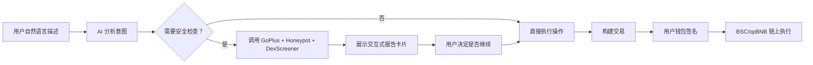

[English](PROJECT.md) | 中文

# BNBrain — 项目概述

> **参赛赛道：Agent（AI Agent x 链上操作）**
> 一个 AI 驱动的安全代理，不只是分析——它能操作、交易、保护链上资产。

---

## 1. 问题

### BNB Chain 上的安全缺口

BNB Chain 每天处理**数百万笔交易**，是最活跃的区块链之一。但高活跃度也带来了阴暗面：

- **Rug pull 和蜜罐代币**每天上线，缺乏验证工具的用户被套牢
- **钓鱼网站**模仿热门 DeFi 协议，窃取钱包授权、盗取资金
- **无限代币授权**在钱包中被遗忘，成为攻击利用的定时炸弹
- **合约漏洞**难以被发现，因为安全审计需要深厚的 Solidity 专业知识

**核心问题：** 现有安全工具**碎片化且被动**。用户必须在 GoPlus、DexScreener、BscScan、PancakeSwap 和 MetaMask 之间手动切换，才能完成一笔安全的交易。每个工具只提供原始数据，没有可执行的建议。最脆弱的非技术用户实际上被排除在安全最佳实践之外。

**受影响人群：**
- **散户 DeFi 用户** — 购买代币时不知道如何检查蜜罐
- **NFT 收藏者** — 铸造前无法验证集合级风险
- **活跃交易者** — 随时间积累高风险授权
- **新用户** — 觉得多工具工作流太复杂，容易犯代价高昂的错误

---

## 2. 解决方案

### 一个 AI 代理搞定一切

BNBrain 是一个**通过自然对话在 BNB Chain 上执行真实操作的 AI 代理**。用户无需在 5 个以上的工具之间切换，只需描述需求——AI 会在统一界面中处理安全扫描、交易、合约部署和钱包管理。

**核心能力：**

- **37 个 AI 工具** — 覆盖安全分析、DeFi 交易、钱包管理、智能合约操作、市场数据和链上存证
- **多源安全交叉验证** — GoPlus + Honeypot.is + DexScreener + BscScan 数据联合，全面风险评估
- **一键兑换** — PancakeSwap V2，每笔交易前内置安全检查
- **智能合约编译与部署** — 在聊天中编写 Solidity，支持 OpenZeppelin，一键部署，自动到 BscScan 验证
- **链上报告存证** — 安全扫描结果哈希上链，作为防篡改证据
- **24 个交互式结果卡片** — 每个工具输出都有丰富的可视化 UI，不只是文字
- **Worker 后台架构** — 用户关闭浏览器标签页，AI 仍持续运行

**BNBrain 与现有工具的区别：**

| 现有方式 | BNBrain |
|---|---|
| 手动：打开 GoPlus，粘贴地址，阅读 JSON | "这个代币安全吗？" → 即时可视化报告 |
| 打开 PancakeSwap，查价格，设滑点，兑换 | "用 0.1 BNB 换 USDT" → 一键确认 |
| 读 Solidity，找编译器，通过 Remix 部署 | "部署一个叫 X 的代币" → 编译并部署 |
| 逐个检查授权 | "扫描我的钱包" → 完整健康报告 + 撤销按钮 |

---

## 3. 商业与生态影响

### 目标用户

1. **核心用户：BNB Chain 上的散户 DeFi 用户** — 任何交易代币、提供流动性或与 dApp 交互并希望安全操作的人
2. **次要用户：BNB Chain 开发者** — 通过对话完成合约部署、验证和测试
3. **延伸用户：安全研究者** — 深度分析报告 + 链上存证

### 对 BNB Chain 生态的价值

- **减少诈骗损失** — 交易前安全扫描捕获蜜罐、Rug Pull 和钓鱼
- **降低入门门槛** — 非技术用户通过自然语言安全参与 DeFi
- **提高交易质量** — 每笔兑换、部署和授权都附带安全检查
- **链上信任层** — 安全报告哈希上链，创建可验证、不可篡改的审计轨迹
- **开源** — MIT 协议，任何项目都可以集成或扩展

### 推广路径

- **阶段一（当前）：** 免费 Web 应用 [app.bnbrain.dev](https://app.bnbrain.dev) — 可通过 Docker/Railway 自部署
- **阶段二：** API 接口，供其他 dApp 集成 BNBrain 的安全扫描能力
- **阶段三：** Telegram/Discord 机器人，社区级安全防护
- **阶段四：** DAO 治理的安全预言机网络，利用链上报告数据

### 可持续性

- 开源核心 + 可选的高频集成者付费 API 层
- 自部署选项确保工具不受商业模式变化影响

---

## 4. 局限性与未来工作

### 当前局限

- **仅支持 PancakeSwap V2** — V3 集中流动性和其他 DEX 聚合器尚未支持
- **仅支持 BSC + opBNB** — 暂无跨链支持（计划：BNB Greenfield 用于报告存储）
- **ReportRegistry 合约** — 已部署到 BSC 主网；后续扩展到 opBNB
- **AI 模型依赖** — 需要 Anthropic Claude API Key；暂无本地模型回退
- **非自主执行** — 所有交易需用户钱包签名（设计如此，出于安全考虑）

### 路线图

| 时间 | 里程碑 |
|---|---|
| **2026 Q1** | 多 DEX 聚合（PancakeSwap V3、BiSwap），跨链桥安全检查 |
| **2026 Q2** | Telegram 和 Discord 机器人，第三方集成 API |
| **2026 Q3** | BNB Greenfield 集成完整报告存储，去中心化安全预言机 |
| **2026 Q4** | 自主监控模式 — 钱包看门狗，对高风险授权/转账自动预警 |

### 开放问题

- 去中心化 AI 推理的最佳方案，降低单一提供商依赖
- 社区贡献安全规则和工具扩展的治理模型
- 隐私保护的钱包分析（零知识证明用于安全评分）
